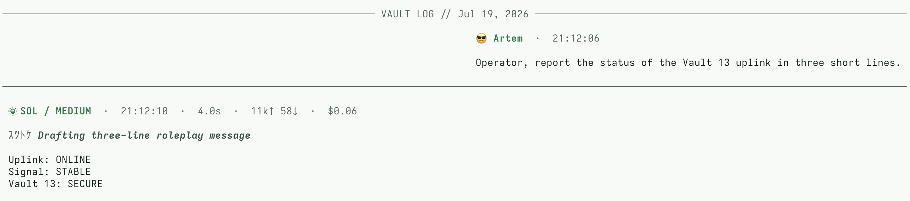
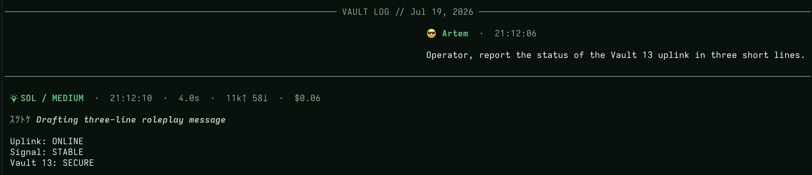

# pi-chat-layout

[](https://www.npmjs.com/package/pi-chat-layout)
[](https://www.npmjs.com/package/pi-chat-layout)
[](LICENSE)

A messenger-style conversation layout for the [Pi coding agent](https://github.com/earendil-works/pi). It adds actor headers, responsive metadata, turn grouping, date separators, and optional alternating alignment without imposing a model or terminal-font theme.

| Light | Dark |
|:---:|:---:|
|  |  |

## Install

After the npm release:

```bash
pi install npm:pi-chat-layout
```

From the repository:

```bash
pi install git:github.com/artplan1/pi-chat-layout
```

Load it for one run with `pi -e npm:pi-chat-layout`. Remove the installed package with:

```bash
pi remove npm:pi-chat-layout
```

## Configuration

Create `~/.pi/agent/chat-layout.json`. Every field is optional; the defaults are alternating layout, `👤 You`, `🤖 <actual model ID>`, separate lower-case thinking metadata, and a plain date separator. No Nerd Font is required.

```json
{
  "layout": "alternating",
  "icons": {
    "user": "👤",
    "assistant": "🤖",
    "thinking": { "high": "" }
  },
  "actors": {
    "user": "You",
    "assistant": { "name": "", "mode": "prefix" }
  },
  "models": { "aliases": {} },
  "header": {
    "metadata": ["thinking", "time", "duration", "tokens", "cost"],
    "style": "separate"
  },
  "dates": { "label": "{date}" }
}
```

`PI_CODING_AGENT_DIR` is respected. Configuration changes hot-reload; invalid JSON keeps the last valid configuration and reports a warning.

### Identity and formatting

`icons.user`, `icons.assistant`, and `icons.thinking.<level>` accept arbitrary strings; use `""` to hide an icon. `actors.assistant.name` can `prefix` or `replace` the model ID.

Model aliases are explicit exact matches. An alias for `openai/gpt-5.6` does not affect `openai/gpt-5.6-preview`; unmatched models always display their actual ID.

`header.metadata` controls the visible assistant metadata and its order. `header.style` is one of:

- `separate` (default): model identity and thinking level are separate header fields.
- `compact`: the thinking icon, assistant identity, and upper-case level are combined as one field.

On narrow terminals, cost and token fields are removed before duration, thinking, and time.

### Compact themed example

This explicit configuration produces a compact identity such as `✦ ◆ SOL / HIGH` and a themed date label, while leaving the neutral defaults portable:

```json
{
  "icons": {
    "assistant": "◆",
    "thinking": { "high": "✦" }
  },
  "models": {
    "aliases": { "openai-codex/gpt-5.6-sol": "SOL" }
  },
  "thinking": { "markerGlyphs": ["ｱ", "ｲ", "ｳ", "ｴ", "ｵ", "ｶ", "ｷ", "ｸ"] },
  "header": { "style": "compact" },
  "dates": { "label": "SESSION LOG // {date}" }
}
```

`thinking.markerGlyphs` is a non-empty array of visible strings. Each marker deterministically selects four entries and reserves a stable column based on the widest entry. Omit it for portable ASCII progress markers. `dates.label` replaces every `{date}` with the localized calendar date.

## Behavior and compatibility

User headers show submission time. Assistant headers show the thinking level active when the response started, completion time, duration, tokens, and cost when available. Follow-up assistant steps retain compact diagnostics without repeating the actor header.

The extension decorates Pi's built-in message components because Pi does not yet provide a public renderer hook. A startup compatibility probe leaves stock rendering in place if those internals are incompatible. Release checks use Pi `0.80.6`; core Pi packages remain host-provided peer dependencies.
## Development

```bash
pnpm install
pnpm check
pnpm pack:dry
```

## License

MIT
